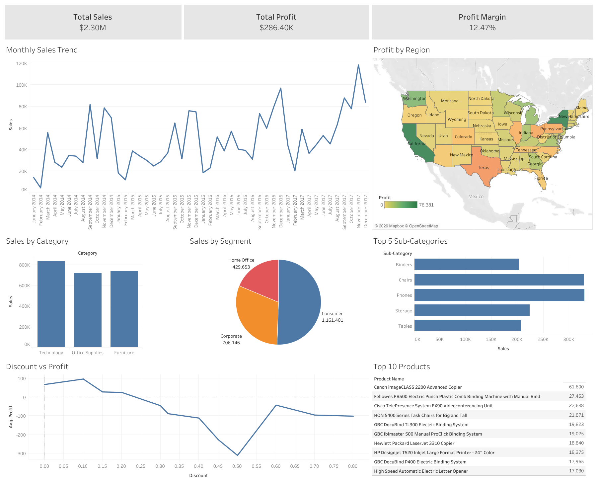

# 🛒 Retail Sales Analysis
---

## Project Overview
This project analyzes retail sales data to identify sales trends, top-performing products, and regional profitability.  
The analysis provides insights to support **data-driven business decisions** and optimize sales strategy.

---
## Tools Used
Python  
SQL  
Tableau  
Excel  

---
## Dataset
Superstore Sales Dataset from Kaggle.  
Key columns:  
`Row ID`, `Order ID`, `Order Date`, `Ship Date`, `Ship Mode`, `Customer ID`, `Customer Name`, `Segment`, `Country`, `City`, `State`, `Postal Code`, `Region`, `Product ID`, `Category`, `Sub-Category`, `Product Name`, `Sales`, `Quantity`, `Discount`, `Profit`

---
## Key Analysis
- Overall business performance: total sales, total profit, profit margin  
- Monthly sales trends to understand revenue changes over time  
- Regional profit distribution to identify geographic performance differences  
- Sales contribution by product category and customer segment  
- Top-performing sub-categories and products based on sales  
- Relationship between discount levels and profitability  

---
## Dashboard

---
## Key Insights
- Total sales reached $2.30M with a profit margin of 12.47%  
- The **Technology** category generated the highest sales among all product categories  
- The **Consumer** segment contributed the largest share of total sales  
- Sales show seasonal spikes toward the end of the year  
- High discount levels (above 40%) significantly reduce profitability
